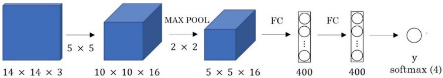

# CNN-brief-introduction

本次编辑为3.10组会内容总结

一共分成了三个部分介绍卷积神经网络

①卷积基本操作与基础知识

②典型网络展示：LeNet-5/Alexnet/VGG-16/ResNet/inception network

③Detection算法简介

## 参考文献

https://blog.csdn.net/u014061630/article/details/80259359

可能列举出现遗漏，如有侵权，请及时联系：zzpzkd@mail.ustc.edu.cn

## 1.卷积基本操作与基础知识

### 1.1卷积操作

卷积操作涉及输入图像，过滤器和输出图像，过滤器分别与输入图像逐个相乘输出结果即为输出图像

**padding概念：**

卷积操作的不好处：卷积出来的图片会缩小，角落中的像素点使用次数较小

Padding就是解决这个问题，在初始图片的周围再填充一圈像素点，通常设为零，p表示填充了几圈

两种卷积的名称

valid convolution：不填充

Same convolution：填充p=（f-1）/2，f一般都是奇数

**卷积步幅：**

原来卷积的时候过滤器每次都向前走一步，现在走s步

**图像大小计算：**

输入图像大小为nh*nw

过滤器的大小为f*f

padding为p，卷积步幅为s

则输出图像大小为($$1+\frac{nh+2p-f}{s}$$)*($$1+\frac{nw+2p-f}{s}$$)

**二维情况拓展成三维情况：**

二维的时候是灰度图像，三维时就变成了RGB彩色图像，除了高度和宽度还加了一个channel维度

那么输入和输出也就变成了

输入图像大小为$$nh*nw*nc$$，nc为channel的数量

过滤器的大小为$$f*f*nc$$，此处的channel数量必须与输入图像的nc相同

padding为p，卷积步幅为s，过滤器的数量为ncc

则输出图像大小为($$1+\frac{nh+2p-f}{s})*(1+\frac{nw+2p-f}{s})*ncc$$

### 1.2池化层

池化层pooling中过滤器中只有空白格，并没有数字。 

一共有两种池化的类型max pooling和average pooling，max pooling是取区域最大值，average pooling取区域平均数（不常用）

上面推算输出的计算公式依然可用

如果是RGB的图像的话每一个channel不互相影响

池化层可以减少高度和宽度上的维数

### 1.3全连接层

把一个图像展成一列数字，再仿照标准神经网络的算法进行降维计算，最终输出给softmax层进行图像分类

全连接层起到将学到的“分布式特征表示”映射到样本标记空间的作用

### 1.4一个卷积网络的基本机构

单层的卷积网络结构和参数数量的计算

一个完整的卷积网络及其参数运算

## 2.典型网络展示

### 2.1 LeNet-5

[LeNet-5](https://cuijiahua.com/blog/tag/lenet-5/)出自论文Gradient-Based Learning Applied to Document Recognition，是一种用于手写体字符识别的非常高效的卷积神经网络

一共有7层，输入不算数，分析32*32的灰度图像

conv1  5x5, 6 stride 1

pool1  2x2 avepool, stride 2

conv2  5x5, 16 stride 1

pool2  2x2 avepool, stride 2

flatten    

dropout rate  0.5

fc3 120

dropout rate  0.5

fc4 84

softmax    10

### 2.2 AlexNet

用来进行图像识别，这个网络有一个很高的效率

输入图片尺寸227*227*3，处理的是RGB彩色图像

Alexnet有什么特点？

（1）ReLU作为激活函数。

    ReLU为非饱和函数，论文中验证其效果在较深的网络超过了SIgmoid，成功解决了SIgmoid在网络较深时的梯度弥散问题。

（2）Dropout避免模型过拟合

    在训练时使用Dropout随机忽略一部分神经元，以避免模型过拟合。在alexnet的最后几个全连接层中使用了Dropout。

（3）重叠的最大池化

    之前的CNN中普遍使用平均池化，而Alexnet全部使用最大池化，避免平均池化的模糊化效果。并且，池化的步长小于核尺寸，这样使得池化层的输出之间会有重叠和覆盖，提升了特征的丰富性。

（4）提出LRN概念

    LRN层是什么？

local response normalizaiton，

bix,ybxi,y是归一化后的值，i是通道的位置，代表更新第几个通道的值，x与y代表待更新像素的位置。

aix,yaxi,y 是输入值，是激活函数Relu的输出值

k、alpha、beta、n/2 都是自定义系数，

总结的来说，是对输入值aix,yaxi,y 除以一个数达到归一化的目的

（5）GPU加速

### 2.3 VGG-16

深层卷积网络，用来进行图像识别，6就是指16层，还有VGG19

VGG16 是13个卷积层+3个全连接层叠加而成

（1）VGG-16网络中的16代表的含义为：含有参数的有16个层，共包含参数约为1.38亿。

（2）VGG-16网络结构很规整，没有那么多的超参数，专注于构建简单的网络，都是几个卷积层后面跟一个可以压缩

图像大小的池化层。即：全部使用3*3的小型卷积核和2*2的最大池化层。

卷积层：CONV=3*3 filters, s = 1, padding = same convolution。

池化层：MAX_POOL = 2*2 , s = 2。

（3）优点：简化了卷积神经网络的结构；缺点：训练的特征数量非常大

### 2.4 ResNet

首先推导一下残差块是什么

残差块在网络中是什么样子的

残差网络为什么会有一个好的效果

### 2.5 google inception network

了解1*1convolution，可以用来压缩channel维度的数量

inception网络的基本结构，让电脑来帮助决定下一层用什么网络结构

引入新的问题，计算成本过高，拿一个32channel的网络来举例子给出解决办法

优化后的inception网络基本结构

最终的成果展示图，可以插入softmax网络用来做分类

## 3. Detection算法简介

### 3.1 综合概述

重新定义输出y的数值，两类问题，一类是car的物体检测，一类是eye特征点检测物体

第一类中的y八元组，损失函数L也变了

第二类中，64个特征点描绘出眼睛，129个数据

### 3.2 sliding window detection

sliding window detection是针对于第一类问题讲优化

不同大小的方框，一点点在图片上滑动，截取的图像放到神经网络上去查是不是车，注意选择框的大小也要变化

首先选定一个特定大小的窗口，并使用以上的卷积神经网络判断这个窗口中有没有车，滑动目标检测算法会从左上角向右并向下滑动输入窗口，并将截取的图像都输入到 已经训练好的卷积神经网络中 以固定步幅滑动窗口，遍历图像的每个区域

然后使用比以上使用的窗口大一些的窗口，重复进行以上操作。然后再使用比上一次更大的窗口进行图像的截取与检测。

所以无论目标在图像中的什么位置,总有一个窗口可以检测到它

但是这种情况会对于卷积计算，计算成本很大，为什么计算成本大？

因为使用窗口会在原始图片中截取很多小方块,并且卷积神经网络需要一个个的进行处理。虽然使用较大的步长可以有效的节省计算成本，但是粗粒度的检测会影响性能，小步幅和小窗口就会大量的耗费计算成本

解决办法：引入FC，变FC为卷积层

使用大小为14∗14∗3的图片作为图片数据,使用16个5∗5的卷积核做卷积操作,得到10∗10∗16的特征图,然后使用2∗2的max-pooling池化算法,得到5∗5∗16的特征图.将结果输入到两层具有400个神经元节点的全连接层中，然后使用softmax函数进行分类–表示softmax单元输出的4个分类出现的概率。

接下来要将最后连接的两个全连接层FC1和FC2转换为卷积层

具体的操作和原理

假设14∗14∗3的图像是从16∗16∗3的图像中截取出来的，即原始图像的大小为16∗16∗3.即首先截取原始图片中的红色区域输入网络,然后截取绿色区域,接着是黄色区域,最后将紫色区域截取出来作为图像数据集。

结果发现，滑动窗口得到的图片进行的这四次卷积运算中的很多计算都是重复的

得到的最终的2∗2∗4的稠密特征图各不同颜色部分都对应了原始图片中相同颜色的经过卷积操作后的结果。 

所以正确的卷积操作的原理是我们不需要把输入图片分割成四个子集，分别传入卷积神经网络中进行前向传播，而是把它们作为一张图片输入给卷积网络进行计算，其中共有的区域可以共享很多计算

### 3.3 YOLO algorithm

上面的优化

有时边界框并没有完整的匹配图片中的对象，或者最佳的边界框并不是正方形，而是横向略有延伸的长方形

所以有一个更精确的算法YOLO

具体操作方式是:假设图像的大小是100∗100,然后在图像上放一个网格，为了描述的简洁，在此使用3∗3的网格，实际中会使用更加精细复杂的网格，可能是19∗19

基本思想是使用图像分类和定位算法(image classification and Localization algorithm)然后将算法应用到九个格子上。

YOLO算法使用的是取目标对象边框中心点的算法，即考虑边框的中心点在哪个格子中。对于中间的三个边框，认为目标对象只存在于第二排第一个和第二排第三个网格中。

所以！！

由于有3*3个网格，所以输出的标签的大小为3∗3∗8,即8表示目标标签的深度，标签堆叠成为了一个长方体的形式而不是二维的堆叠方式

那么如何去判断效果的好坏？？

IoU交并比算法

如何评价一个算法的好坏，即如图中假设红色框线表示 真实的对象所在边界框，紫色框线表示 模型预测的对象所在边界框.通过计算两个边界框交集和并集的比用于评价对象检测算法的好坏

在对象检测的算法中，如果IoU>0.5则认为检测正确。0.5是人为定义的阈值，也可

以定义为0.5及以上的值

上面的算法遇到的问题？

格的面积太小的时候

对于如图的对象检测，使用19∗1919∗19的网格，在进行预测的同时，两辆车中心旁的其他网格也会认为目标对象的中心点在其中。如图绿色和黄色方框中显示。

为了清理多余或错误的检测结果，使用非极大值抑制算法Non-max suppression 

**思想**：只输出概率最大的分类结果–即挑选出检测pc最大的边框，而其余和该边框IoU(交并比)很高的其他边框则会认为是在检测同一对象，则另外的和最大Pc边框IoU很大的边框都会变暗。

**算法**：假设只检测汽车这一个对象，所以去掉目标标签向量中的c1,c2,c3

去掉所有pc≤0.6的边框，抛弃所有概率比较低的输出边界框。 

while 还有边界框剩下:

在剩下的没有被抛弃的边界框中一直挑选pc最高的边界框

在剩下的边界框中将与最高pc有较大IoU(IoU≥0.5)的边界框全部抛弃 

如果要检测的对象不止汽车一个，还有行人和自行车的对象，正确的做法是:独立进行三次非最大值抑制，对每个输出类别都进行一次

再考虑一种情况：先前介绍的方法只能使格子检测出一个对象，如果想要一个格子检测出多个对象– **anchor box**

使用3∗3的网格检测图中的对象，注意行人的中点和汽车的中点几乎都在同一个地方，两者都落入同一个格子中。使用原先的目标标签，只能选择两个类别中的一个进行识别。

此时可以使用Anchor策略–即使用特定形状的Anchor box 作为边界框，则策略需要把预测结果与anchor boxes 关联起来。以处理两个识别对象的中心点落入同一个网格中的情况。

则此时边界框的目标标签可以被编码为

具体的操作过程图

单目标图像检测算法–对于训练集图像中的每个对象，都根据对象的中点的位置，分配到对应的格子中。所以输出y是3∗3∗8, 使用anchor boxes 策略，每个对象不仅和之前一样被分配到同一个格子中，还被分配到对象形状交并比最高的anchor boxes中，假设只检测图片中的两个对象则输出y为3∗3∗16

Anchor boxes算法处理不好的情况

两个对象的中点在同一个网格中，并且使用 同一种形状 的Anchor Boxes检测

有超过两个的对象的中点在同一个网格中。
