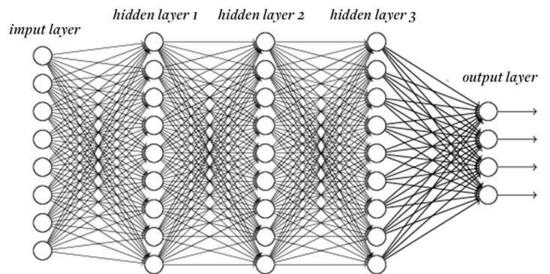
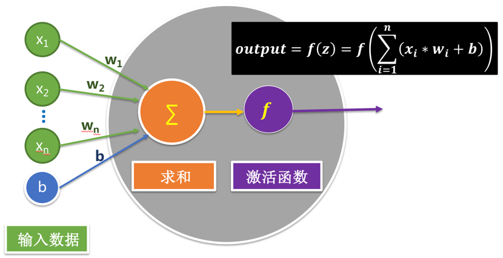
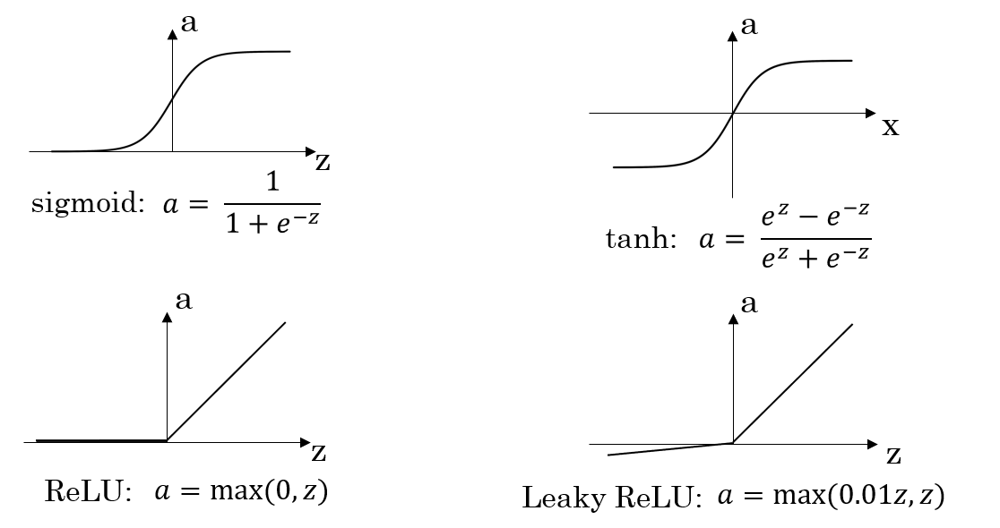
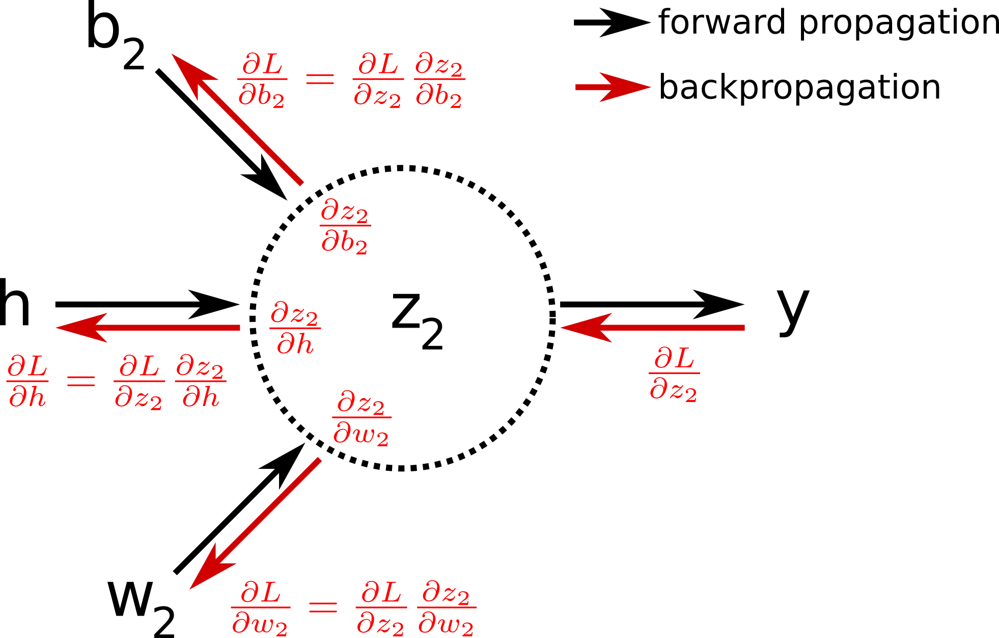
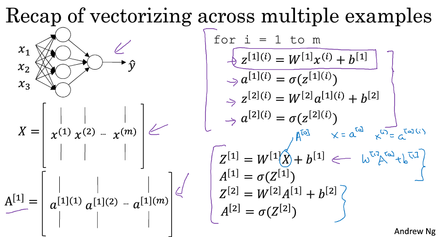
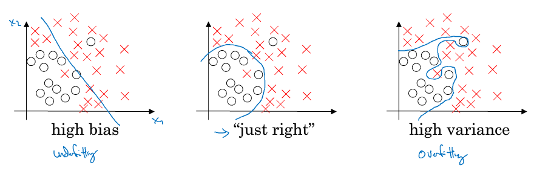
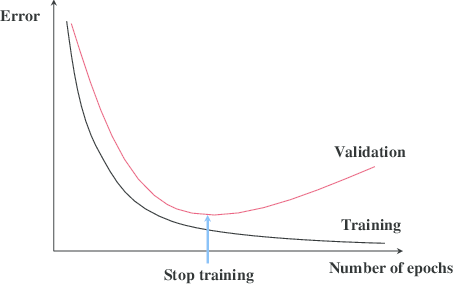
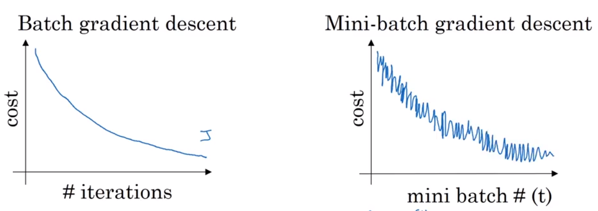
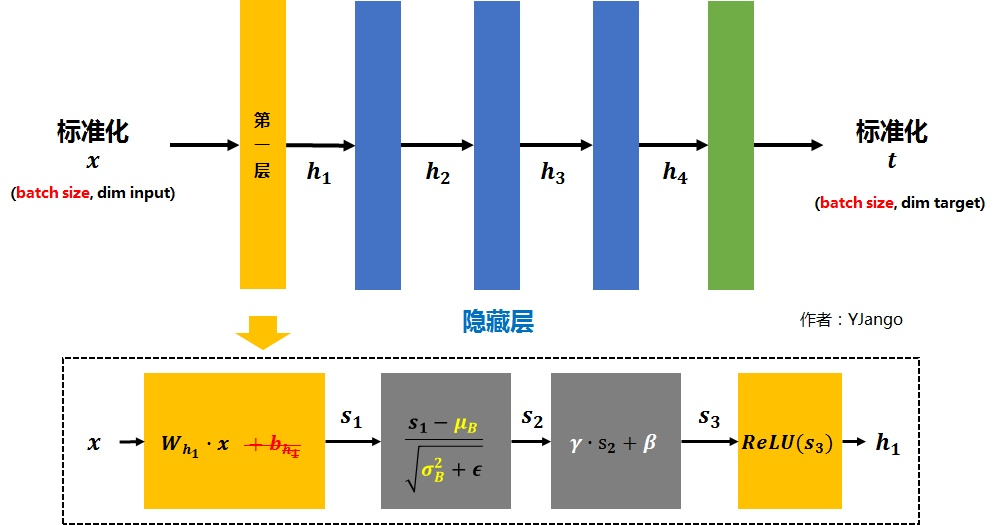

# 基础知识讲解

## 讲述神经网络的基本模型

输入是各种因素各种变量，经过各个神经元的作用，输出为预估结果。

作用图可以用这个来类比。



整个网络由输入层，隐藏层和输出层组成，但是最后算总层数的时候不算输入层。

在吴恩达深度学习的课程视频中，老师是用房价因素来预测房价的，比如输入的值有房子大小size，地理位置location，房间数目bedrooms，是否是富人区wealth等因素来决定的，这些作为输入，输出是房子价格的预测值。

## 训练集、验证集、测试集

- 训练集train set：用于训练，输入x，输出y，y也称为标签，每一个(x,y)都是一个确定的，所以需要对每一个输出x打标签！
- 验证集dev set：用于在训练过程中检验模型的状态，收敛情况。验证集通常用于调整超参数，根据几组模型验证集上的表现决定哪组超参数拥有最好的性能。同时验证集在训练过程中还可以用来监控模型是否发生过拟合，一般来说验证集表现稳定后，若继续训练，训练集表现还会继续上升，但是验证集会出现不升反降的情况，这样一般就发生了过拟合。所以验证集也用来判断何时停止训练。总而言之，验证集的作用是选择一个比较好的网络模型。
- 测试集test set：测试集是完全独立于训练集之外的，用来在训练完成之后测试该模型的正确率。测试集与验证集应该来自于同一分布。有时没有测试集也可以。
- 三者比例大致为60,20,20。

## 讲述神经网络的作用原理，深刻剖析一个神经元

从一个分类问题入手，我需要输入一张图片，然后由神经网络作各种复杂的运算，最后的输出是判断这张图片（64 *64 *3的大小）上的物体是不是一只猫，（为了方便，在这里假设这张图片上只有一个物体，如果图片上设计很多个东西则是语义分割的范畴）。

那么针对于一个特定的神经元它是怎么工作的呢？



这是单个神经元工作的原理，输入的是x1-xn这些数据，比如一张图片的所有像素点值，它的数据量也是非常大的！还有输入的是权重w和偏置b，实际上对于一个已经训练好的网络来说，每一层神经元，每一个神经元的区权重和偏置只输入一次就不会变了，而对于没有训练好的网络来说，我们用来训练的数据中重要的一项就是权重参数和偏置参数，具体怎么训练的在下面还会讲解。

参数输入进去首先是一个求和操作，在进行一个非线性函数作用
$$
z = \sum_{i=1}^{n}{xi*wi} + b
$$

$$
a = f(z)
$$

先说求和操作，权重w分别与元素x相乘相加，最终加一个偏置b，特别注意图片上的公式是错误的。非线性函数作用是为了防止线性化，它在神经网络中的学名是激活函数，如果不加这个非线性函数的话，不管多么深的网络都可以被压缩成一层，而至于函数的选择是在业内同行不断的摸索和实验中总结出来的，著名网络AlexNet的重要贡献之一就是提出了Relu激活函数，目前很多网络都是采用的这个函数，其他的一些函数如下图所见。值得一提的是，在二分类的网络中，因为最后输出的是一个概率值，来表示这张图片是猫的概率，所以采用的是sigmoid函数，把输出值控制在0-1的范围之内。

参考代码如<https://blog.csdn.net/jingyi130705008/article/details/78735031>



然后得到的输出a则作为下一层网络的输入继续这个训练，这个环节就是神经网络的正向递归环节。

## 正向递归到最后怎么办

还是用到前面的概率预测的模型的例子，到最后一层神经元的时候，由于我们只要输出一个概率的预测值，那么最后一层即输出层也只有一个神经元，这个神经元的输出就是整个网络的输出。所以有
$$
a^{[n]} = \hat{y}
$$
其中\hat{y}表示该网络的预测值，数值介于0,1之间，真实值也就是在训练集中打的标签用y来表示，只有可能是0和1两个数值，因为这个图片只有是猫和不是猫这两种情况。

最后引入一个损失函数(loss function)和代价函数(cost function)作为衡量值，其实损失函数和代价函数的选取有很多种，这里我们引入交叉熵损失函数(cross entropy loss)，在以后遇到的网络中，该损失函数的存在感很强。定义如下
$$
L(\hat{y},y) = -(y*log(\hat{y})+(1-y)*log(1-\hat{y}))
$$
来分析一下这个函数，y只有两个取值，0或者1，y=1的时候公式后半段不起作用，前面的应该是我们愿意使\hat{y}变得无限接近于1，而\hat{y}越大，最终的L越小；而y=0时则是同理，所以结论就是我们要尽最大的努力使L变小。

当然，前面的损失函数只是对于这个样本得到的数据，训练集存在成百上千个样本，比如一共有m个样本，那么如何衡量这个整体样本的损失函数呢，就是将每一个样本的损失函数相加求平均，这就是代价函数。公式如下
$$
J（w,b) = \frac{1}{m} * \sum_{i=1}^{m} L(\hat{y}^{(i)},y^{(i)})
$$

## 如何来训练参数w和b，后向递归算法讲解

网络来训练什么？就是来训练w和b，从一开始输入的w和b就是人为给定的，为初始值，然后经过好多次运算，得到使代价函数最小的w和b，再用这个最优的w和b去测试集中进行测试，进而达到应用的层面。

训练的过程是采用后向递归的算法，从最后的损失函数入手，对于一个单个的神经元来说是流程图是这样的，计算他们对于前一个输入的微分倒数

所以说对于最后一层的神经元的作用是这样的
$$
\frac{dJ}{da} = \frac{dJ}{d\hat{y}} \triangleq  da = d\hat{y}\\\frac{dJ}{dz}=\frac{dJ}{da}*\frac{da}{dz}=\hat{y}-y \triangleq dz \\ \frac{dJ}{dw}=\frac{dJ}{dz}*\frac{dz}{dw}=x*(\hat{y}-y) \triangleq dw \\ \frac{dJ}{db}=\frac{dJ}{dz}*\frac{dz}{db}=1*(\hat{y}-y) \triangleq db \\ w_{new} = w_{origin} - \alpha*dw \\ b_{new} = b_{origin} - \alpha*db
$$
求得w参数和b参数的偏分项，然后更新迭代得到新的w和b，重新输入到网络中，进行循环，最终求得最优的w和b使整个样本的代价函数最小。*α* 被称为学习率，也就是每次迭代这些超参数下降的频率，这是一个超参数，要在训练之前就选好，一般选的都很小，选在0.1以下。

而由于前几层神经元没有最后的损失函数的一项，因此要去掉第一个dJ的作用项即可。所以在后退到第一层的网络的时候，整个网络的计算量是很大的。

Note：用于迭代的是代价函数J，而不是损失函数L，J是对所有的样本进行求和的平均值。参考https://blog.csdn.net/jingyi130705008/article/details/78735031

## 所有样本的向量化

在实际的操作中，输入图片时并不是一个样本一个样本地进行输入，而是把所有样本向量化，统一输入到网络中进行训练。向量化的具体操作可以参见下图。



在这个里面要注意到一些上标和下标的用法，上标小括号表示是第几个样本，上标中括号表示是网络第几层，下角标是对同一个样本的元素或对同一层的权重进行标号。

## 多分类网络模型：softmax网络

于二分类网络来说，只需要判断输入图像是不是一只猫，而多分类网络则是输入一张图片，该图片也是只包含一个物体，最终输出这张图片上的物体到底是什么，给出是每一类东西的概率。比如用PASCAL-VOC2012数据集进行训练，该数据集一共有20类物体，所以我们最后的输出结果就是一列20* 1的向量，分别来表示这20类物体的预测概率。

在激活函数的选取中，并不是用到sigmoid函数，而是用到ReLu函数，最后一层输出层中有20个神经元，但是输出的结果都已经大于了1，这是需要再将输出层在输入到softmax网络中做一个标准化输出。

softmax网络的作用得到一个标准的概率。如果分类目标一共有S类，那么softmax层要求输入进来的特征向量，也就是经过全连接层处理的输出向量，必须是S* 1的维数，在softmax层处理的过程中，特征向量的维数并不会减少，因此最终的输出也是S* 1维，分别代表了识别物体为各个类的概率。

在softmax层处理输入向量遵循下面的公式，其中a代表输入特征向量的元素的值，s代表输出特征向量的值，i和j是它们的下标，代表该元素在整个向量中的序号。
$$
sj=\frac{e^{aj}}{\sum_{i=1}^{S}e^{ai}}
$$

### softmax分类网络的损失函数

在拿到网络对于输入图片分属不同类的预测概率值后，必须借由损失函数才能评估网络的好坏，softmax分类网络的损失函数定义为，
$$
L = -\sum_{i=1}^{S}yi*log(si)
$$
其中L代表整个损失函数的值，S表示一共有S类，s代表从softmax层的输出特征向量各元素的值，y表示输入图片的真实值，也就是说在一共S类中，输入图片只属于其中一类，则该类的y的值为1，其余S-1个元素的值全部为0。鉴于该性质，损失函数L也可以写成
$$
L = -log(si)
$$
此处必须限定i是指向当前输入图像的真实标签。

## 关于输入x与权重w初始化的问题的概述

- 输入归一化：inputs normalization

  操作思想：输入数据的均值为0，在各个方向上的方差为1.

  这样做的原因，输入数据的范围也会影响到最后代价函数的取值范围，如果可以规定一个更格式化的取值范围，在最后通向最优代价函数的过程会变得顺利一些。输入x标准化的公式
  $$
  \mu = \frac{1}{m}\sum_{i=1}^{m}x^{i} 
  \\ \sigma^{2} = \frac{1}{m}\sum_{i=1}^{m}(x^{i}-\mu)^{2}
  \\ x_{norm}=\frac{x-\mu}{\sigma}
  $$
  


- 关于权重w的初始取值，由于参数b只涉及到了很小的一部分，所以现在先忽略b的作用，仅仅考虑w来看，如果上一层的神经元数量n过多，那么需要同等数量的w元素与之匹配，因此一般来说该神经元输出的z也就越大，为了避免出现梯度爆炸的现象，所以应该压缩w的初始取值，所以一般初始化权重的时候会采用下面的代码：

  ```
  import numpyas np
  W = np.random.randn(node_in, node_out) * np.sqrt(2 / node_in)
  ```

  np.sqrt(2 / node_in)返回w一个(node_in, node_out)大小的矩阵，具有标准的正态分布，对于不同的激活函数来说，后面相乘的因子也不同，上图中展示的是ReLu函数的因子。如果激活函数是正切函数tanh，则变为了np.sqrt(2 / node_in)

- 上面提到了梯度爆炸与梯度消失的问题，它是这样的，对于一个神经元来说，设它的b=0，激活函数为g(z)=z，那么通过很多层的累积，最终输出结果就是a=w1w2w3......wn*x，如果参数w都大于1，累积出来的a就会是一个很大的值，如果参数w都小于1，哪怕是0.99，很多个w相乘累积起来就是一个很小的值，这就是梯度爆炸与梯度消失。

# 训练过程中遇到的一些问题

对于一个神经网络，除了上面对于参数w和b的训练外，还需要考虑，网络层数，每层网络的神经元数量，学习率和激活函数，这些都要在训练一开始就确定好。所以这些才是真正的难点，一般都是通过不断的尝试才能求得最好的结果。

## 方差与偏差

- 高方差high variance：在训练集上错误率比较小0.01，而在验证集上错误率比较高0.11。训练实现了过拟合。
- 高偏差high bias：在训练集上错误率高0.15，在验证集上错误率也比较高0.16。
- 高方差+高偏差：训练集错误率高，验证集错误率更高。
- 低方差+低偏差：训练集错误率低，验证集错误率也低。just right！！
- 贝叶斯误差beyas error：是指最优的误差，一般为0%。但有时侯也很高。

形象表示



## L2正则化Regularization

解决high variance高方差问题可以增大训练集，但是这需要很大的代价。因此我们选用正则化的方法。

正则化就是对原来的代价函数J在后面添上了一个L2正则化的距离（关于L1范数和L2范数：L1范数是求一个向量中的所有的绝对值的相加；L2范数是一个向量中的所有元素的平方和再开方。这里用到的是L2范数。），它的具体的变化如 下面的公式
$$
J（w,b) = \frac{1}{m} * \sum_{i=1}^{m} L(\hat{y}^{(i)},y^{(i)}) \\ \downarrow \\ J（w,b) = \frac{1}{m} * \sum_{i=1}^{m} L(\hat{y}^{(i)},y^{(i)}) + \frac{\lambda}{2m}*||w||_{2}^{2}\\ =\frac{1}{m} * \sum_{i=1}^{m} L(\hat{y}^{(i)},y^{(i)}) + \frac{\lambda}{2m}*\sum_{l=1}^{L}||w^{[l]}||_{2}^{2}
$$
上面的[l]表示是神经网络的第l层，lambda表示是超参数，这样的话，后向递推也会发生变化了，
$$
dw^{[l]}=dw^{[l]}+\frac{\lambda}{m}*w^{[l]} 
\\ 更新公式：w_{new}^{[l]} = w_{origin}^{[l]} - \alpha*dw^{[l]}
\\ =w_{origin}^{[l]} - \alpha*(dw^{[l]}+\frac{\lambda}{m}*w^{[l]})
\\ =(1-\frac{\alpha*\lambda}{m})*w_{origin}^{[l]}-\alpha*dw^{[l]}
$$
鉴于此式，L2正则化又称为权重衰减

解决几个问题：

- [ ] 为什么不用L1范数，实验表明如果用到L1范数来做迭代的话，w向量中会出现很多是0的元素值。

- [ ] 为什么没有关于b的L2正则化，因为b只是一个数字，而w是向量，很多个数字，有没有b都无所谓了，不会影响很多。

- [ ] 为什么正则化会防止过拟合，来形象表示一下的话是这样的，
  $$
  \lambda\uparrow \ \Rightarrow \ w\downarrow \ \Rightarrow z=w*x+b\downarrow
  $$
  如果w减小的话，很多隐藏层的神经元起到的作用就会变小；如果z变小的话，它会集中在一个很小的区域范围内，呈现一个线性的状态。不管怎样整个网络的线性性会增强，网络结构会相对变得简单，而一个简单的网络是不可能完成一个复杂的过拟合分类的。

## Dropout方法

除了L2正则化方法外，dropout也是一种正则化的方法，可以来避免过拟合。由于在计算机视觉领域用到的数据量巨大，很容易发生过拟合，所以dropout算法在计算机视觉领域的用途比较广。

它的基本思想是什么？对每一层隐藏层，设置一个keep_prob来表示该层中每一个神经元被抛弃的概率，通过这种随机抛弃神经元的算法，可以使得在网络进行训练的时候变得简单。不同层的keep_prob可以不一样，每次训练完一个样本再去训练下一个样本的时候都要重新运行这个随机的过程。而在测试环节是保持所有的神经元都处于工作状态的。


dropout为什么会起作用？一种直观的解释是对于每一个神经元来说，它的上一层输入进来的数据都可能随时会发生变化，所以它不能过度依赖于上一层的某一个神经元，不能过度依赖一个特征。这使得网络更不易发生过拟合。

<https://blog.csdn.net/ytusdc/article/details/86021257>

参考代码：inverted dropout算法反向随机失活

1. 在训练阶段，对执行了dropout操作的层，其输出激活值要除以*keep_prob*。
2. 测试阶段则不执行任何操作，既不执行dropout，也不用对神经元的输出乘*keep_prob*。

```
  a1 = np.maximum(0, np.dot(W1, X) + b1) #relu
  d1 = (np.random.rand(*a1.shape) < p)# first dropout mask. 
  a1 *= d1 # drop!
  a1 /= p
```

最后一行代码/p是为了确保这一层的激活值平均值不会变，因为这一层少了很多个神经元，而整体/p可以有效避免。

在tensorflow中实现dropout：

<https://blog.csdn.net/qq_35358021/article/details/84646667>

```
hidden_layer = tf.nn.dropout(hidden_layer,keep_prob)
```

## 其他可以预防过拟合问题的方法

- 增大数据集的方法有很多种，把训练集的图片做反转可以理论上增加训练集的数量
- early stopping：提前终止训练



在验证集的错误率开始回升之时停止训练，虽然这个时候并不会达到最优的效果。

## mini-batch算法

在样本数量过于多的情况下，不可能全部向量化以此全部输入，这个时候要分批输入，比如50k个样本，一共分成500个batch，每个batch的大小是100个样本，这便是mini-batch算法的基本概念。

mini-batch的标记是上角标的{}，mini-batch每个batch的数量一般是选择8,16,32,64,等等。它的代价函数会出现一个波动，因为每次进行一个训练并不是遍历整个样本，而是遍历一个batch，而遍历完一个样本，也做了好多次梯度下降。



对于batch类算法做batch normalization=BN

参考链接：https://www.jianshu.com/p/94f7985a957d

- 基本思想：结合前面的输入x正则化，我们输入x的操作是对输入样本做0-1处理（即减均值，除以标准差）。而BN算法则是最输入正则化的延伸，对于网络的每一层网络输出的向量a，都再次对它们做一个输入正则化，这样的网络就是BN算法。

  

  可以看到，由标准化的x得到第二层的输入h1的时候，经历了如下的步骤：

  1、第一层的权重项w 和 输入x想成，得到s1

  2、对s1进行0-1均值方差标准化，得到s2

  3、设置两个参数γ 和 β ，计算γ * s1 + β 得到s3。注意，这里的γ 和 β是网络要学习的变量。

  4、将s3经过激活函数激活之后得到h1

- tensorflow实现BN：

  ```
  batch_mean, batch_var = tf.nn.moments(data, [0])
  scale2 = tf.Variable(tf.ones([units]))
  beta2 = tf.Variable(tf.zeros([units]))
  data = tf.nn.batch_normalization(data, batch_mean, batch_var, beta2, scale2,variance_epsilon=1e-3)
  ```

  我们需要输入我们的data，即w*x，然后还有刚刚用moments函数得到的均值和方差，scala和offset即前文提到的的γ 和 β ，这是两个Variable。

  可以看到，我们输入的第一个参数是我们的data，一定要记住，这个data是w*x之后的。第二个参数是我们要在哪一维做标准化，如果是二维数据，通常每一列代表的是一个特征，因此我们一般选择axis=[0]，如果你想对所有的数据做一个标准化，那么axis=[0,1]。另外附BN的原函数

  ```
  tf.nn.batch_normalization(
      data,
      mean,
      variance,
      offset,
      scale,
      variance_epsilon,
      name=None
  )
  ```

- BN的好处，以及为什么会好？

  (1) 减轻了对参数初始化的依赖，这是利于调参的朋友们的。(2) 训练更快，可以使用更高的学习率。(3) BN一定程度上增加了泛化能力，dropout等技术可以去掉。

  从某种意义上来说，gamma和beta代表的其实是输入数据分布的方差和偏移。对于没有BN的网络，这两个值与前一层网络带来的非线性性质有关，而经过变换后，就跟前面一层无关，变成了当前层的一个学习参数，这更加有利于优化并且不会降低网络的能力。

