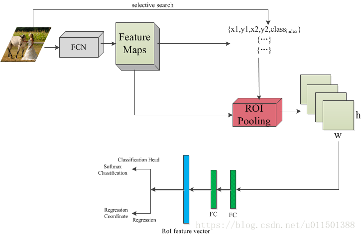

3.5 损失函数的计算

sub pixel convolutional layer

RCNN briefing

[Rich feature hierarchies for accurate object detection and semantic segmentation](http://openaccess.thecvf.com/content_cvpr_2014/html/Girshick_Rich_Feature_Hierarchies_2014_CVPR_paper.html)

1. 产生2000多个与类别无关的候选区域regional proposal，用到的是selective research是算法[Selective search for object recognition](https://link.springer.com/article/10.1007/s11263-013-0620-5)   思想，伪代码：我也不是很懂为什么要把S集中所有的东西要变成空集。
2. 特征提取，之前的候选区域归一化成同一尺寸227*227，有很多种方法，论文中的操作是在候选区域周围加上16个padding，再进行各向异性缩放。经过Alexnet的作用，最终生成的特征向量是4096维的。
3. 分类，SVM二分类器，给每个特征向量的每个类别进行单独的打分，表示是这一类的概率，最后显示在整个图片上，拒绝掉一些和高分区域的IOU大于阈值的候选框。
4. 位置精修，使用一个回归器regressor进行精修

SPP Net=spatial pyramid pooling layer

[Spatial pyramid pooling in deep convolutional networks for visual recognition](https://ieeexplore.ieee.org/abstract/document/7005506/)

解决的问题CNN对输入图片尺寸的限制，用这两张图片来解释一下这个原理

即是将任意尺寸的feature map用三个尺度的金字塔层分别池化，将池化后的结果拼接得到固定长度的特征向量（图中的256为filter的个数），送入全连接层进行后续操作。后来的Fast RCNN网络即借鉴了spp的思想。其中的ROI Pooling可理解为单尺度的SPP层。

Fast RCNN

[Fast r-cnn](http://openaccess.thecvf.com/content_iccv_2015/html/Girshick_Fast_R-CNN_ICCV_2015_paper.html)

 

上图即为整个RCNN做的修改，照着这个图来看的话

- 输入是224×224的固定大小图片
- 这里有两个分支，一路送入FCN，输出 feature maps，
- 另一路通过selective search提取region proposals，其中每个region proposals用四元数组进行定义，即(r, c, h, w)，即窗口的左上行列坐标与高和宽。
- 这里的坐标均是对应原图像的，而不是输出的feature maps。因此，还需要把原图像的坐标系映射到feature maps上。
- 进入ROIPooling层，RoI层的作用：
   考虑到感兴趣区域（RoI）尺寸不一，但是输入图中后面FC层的大小是一个统一的固定值，因为ROI池化层的作用类似于SPP-net中的SPP层，即将不同尺寸的RoI feature map池化成一个固定大小的feature map。具体操作：假设经过RoI池化后的固定大小为是一个超参数HxW，因为输入的RoI feature map大小不一样，假设为hxw，需要对这个feature map进行池化来减小尺寸，那么可以计算出池化窗口的尺寸为：(hxw)/HxW，即用这个计算出的窗口对RoI feature map做max pooling，Pooling对每一个feature map通道都是独立的。
- 再经过两个output都为4096维的全连接层
- 分别经过output各为21和84维的全连接层（并列的，前者是分类输出，后者是回归输出），最后接上两个损失层（分类是softmax，回归是smoothL1）。
- 一个进行全连接之后用来做softmax回归，用来对RoI区域做物体识别，另一个经过全连接之后用来做b-box regression做修正定位，使得定位框更加精准。

链接：https://www.jianshu.com/p/afcd08eb51c5

Faster RCNN

[Faster r-cnn: Towards real-time object detection with region proposal networks](http://papers.nips.cc/paper/5638-faster-r-cnn-towards-real-time-object-detection-with-region-proposal-networks)

网络结构

整个网络结构一共有四层

1. 卷积层，13个conv，13个relu和4个pooling，conv层的相关参数是：kernel_size=3,padding=1,stride=1 其实相当于same卷积，pooling的相关参数是kernel_size=2,padding=0,stride=2 所以每经过一个池化层原图就变成(M/2)x(N/2)大小，经过5个池化，变成(M/16)x(N/16)大小。

2. RPN网络，目的是生成检测框，这个网络有些复杂。可以看到RPN网络实际分为2条线，上面一条通过softmax分类anchors获得foreground和background（检测目标是foreground），下面一条用于计算对于anchors的bounding box regression偏移量，以获得精确的proposal。而最后的Proposal层则负责综合foreground anchors和bounding box regression偏移量获取proposals，同时剔除太小和超出边界的proposals。其实整个网络到了Proposal Layer这里，就完成了相当于目标定位的功能

   链接：https://www.jianshu.com/p/a3f763fc4ec3

3. ROI Pooling，这个是将上面的信息进行整合，输出大小相同的proposal feature maps，操作方法是对于不同的输入图像，做不同的均分，然后做max pooling处理，最后就实现了fixed-length output固定长度输出。

4. 分类classification，这一层一共做两个事情，第一个是通过softmax网络对输入的PFM做分类，第二个是对bounding box做一个regression回归，这个可以获得更高的精度，得到更精确的检测框。

