# RNN-brief-introduction

本次编辑为3.10组会第二部分内容总结

一共分成了四个部分介绍卷积神经网络

①   RNN 总体认知

②    RNN基本模型

③    GRU

④    LSTM

## 参考文献

如有侵权，请及时联系：zzpzkd@mail.ustc.edu.cn

## 1.RNN总体认知

输入和输出都是一个序列，课程是用一些例子来解释这个问题

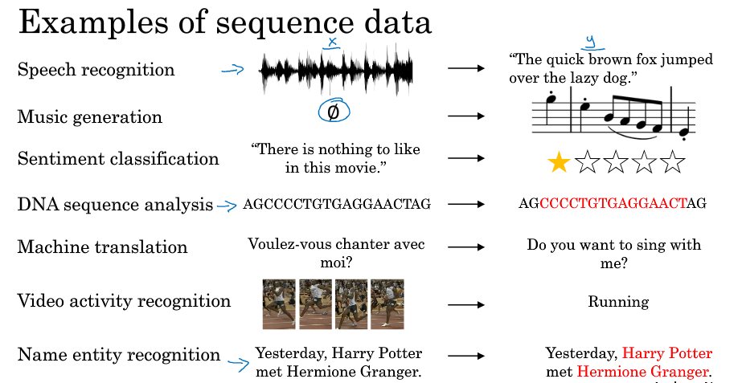

建立一个词库，用一个序列来表示它，比如一个10000词的词库

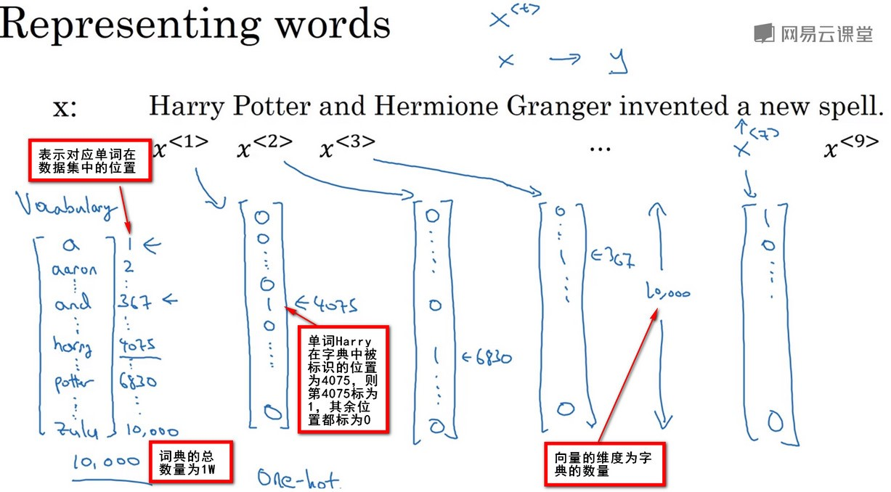

使用方法

使用X1,X2,X3...XT...X9来表示输入数据

使用Y1,Y2,Y3...YT...Y9来表示输出数据

使用Tx来表示输入序列的长度，Tx=9

使用Ty来表示输出序列的长度，Ty=9.

训练数据集中第i个样本的第t个输入序列使用X(I)<t>表示

训练数据集中第i个样本的第t个输出序列使用y(I)<t>表示

使用T(i)x来表示训练数据集中第i个样本输入序列的长度

使用T(i)y来表示训练数据集中第i个样本输出序列的长度

 

另外，除了词库还可以是字母的词

根据实际问题，还可以建立基于字符的RNN结构，你的字典仅包含从a到z的字母，可能还会有空格符，数字0-9，还有大写的A-Z字母，还有数据集中出现的特殊字符。最终使用这些字符组成你的字典。

这样每次RNN推断的输出都是字母而不是单独的词汇。

优点与缺点 

优点是不会出现未知的标识缺点是使用字符进行采样的模型会得到很多很长的序列

因为一句话中的英文单词仅有几十个，但是字符的长度却有很多个，这样使得RNN的长度过大，使得其不可以捕捉长范围的关系，而且训练起来计算成本比较高昂。

所以现有的RNN都是使用基于单词的采样，但是随着计算机性能越来越高，使用基于字符进行采样也是一种趋势

为什么不用以前用过的标准网络？

主要就是图中说的这两点：一点是输入的长度不一样

第二就是不共享

在不同的例子中输入数据和输出数据具有不同的长度，即每个数据不会有一样的长度 

也许每个语句都有最大长度，能够通过Padding 的方式填充数据，但总体来说不是一个好的表达方式。

不共享从文本的不同位置上学到的特征 

例如普通神经网络可以学习到Harry这个单词出现在x<1>的位置，但是如果Harry这个单词出现在x<4>的位置，普通的神经网络不能识别的出来

## 2 RNN基本结构

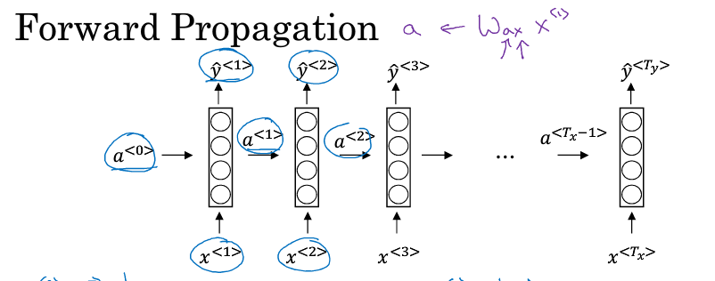

来看这张图来分析一下，导出y和a的表达公式，a<0>是一个随机选取的初始激活值，在这里假设x的长度和y的长度是一样的

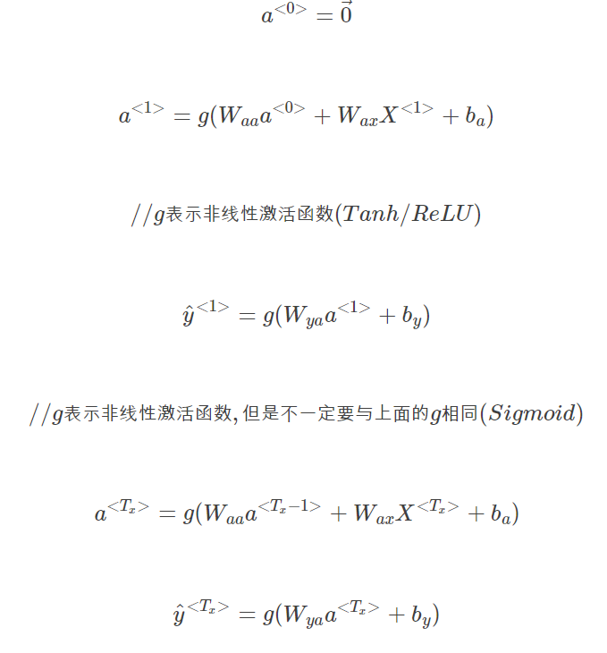

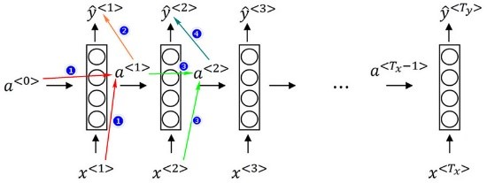

推导公式网络化

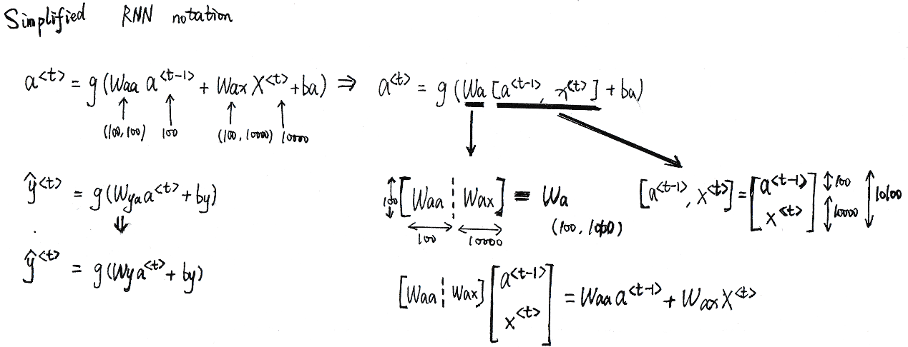

L损失函数

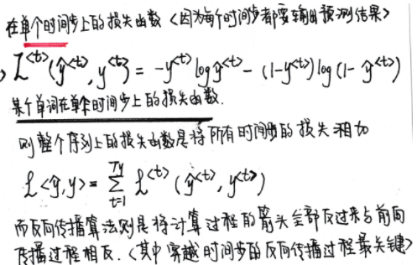

但是上面的网络存在一个问题，下面就一个一个来解决这些问题

就是只能接受序列以前的信息，不能接受以后的信息，这会造成很大的问题，比如

Teddy bear和teddy Thomas

这个时候做出的修正是加上后向传递网络形成BRNN双向循环神经网络

每个激活值由双向的函数进行激活

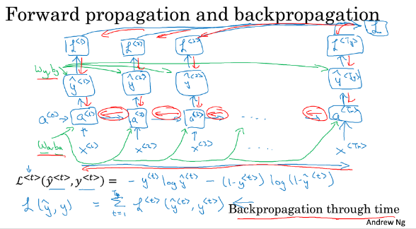

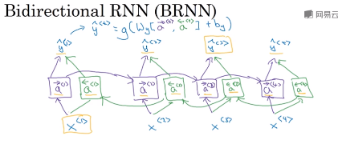

第二个问题是x和y的个数的问题，前面的都是默认x=y

多对一循环神经网络

对于情感识别问题而言，RNN的输入是一段文本序列，输出是一个分类的评价–输出的是一个数值。 

则只在输入整段文本后，在最后一个时间步进行预测，输出分类的结果，而不是每读入一个单词后输出结果。

这是一个典型的多对一问题。 

一对多循环神经网络

对于音乐生成问题而言，RNN的输入是一个数字或者一个单词，输出是一段音符。 

X通常是一个数字用于表示想要生成的音乐类型，或者是生成音乐的第一个音符，或者X也可以为空为0向量。

在第一个时间步输入X,再往后的时间步，不进行输入，但是输出随时间步的生成的音符，一直合成到这个音乐作品的最后一个音符。

在这个例子中，需要将生成的输出也作为输入传入下一层

输入和输出序列长度不等的循环神经网络

对于机器翻译的问题而言，输入句子的单词的数量和输出句子的单词的数量可能不同 

通常在不同的时间步中依次读入输入序列，全部读完后，再输出RNN的结果，这样就可以使得RNN的输入序列长度和输出序列长度不同了。

这种网络可以被分为两个部分，其中前段部分被称为编码器“encoder”用于获取输入序列，后段部分被称为解码器“decoder”，其会读取所有输入然后输出翻译成其他语言的结果

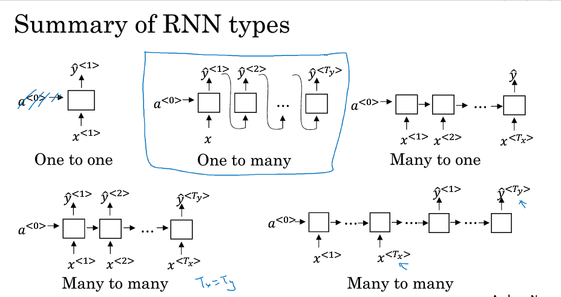

## 3 **门控循环神经网络**

GRU **Gate Recurrent Unit门控循环神经网络**

GRU所针对的内容，cats后面是was 还是were为了记住话语中cat是单数还是复数，在时间T上需要使用记忆细胞memory cell 记住cat这个单词，并且 c<t>=a<t>c<t>=a<t> 

过程

在每一个时间步t,都将用一个候选值c˘<t>重写记忆细胞的值

其中:

c˘<t>=Tanh(Wc[c<t−1>,x<t>]+bc)[1]

GRU中真正重要的思想是，GRU中有一个门Gate(γu) 这是一个0到1之间的值 

γu=σ(Wu[c<t−1>,x<t>]+bu)[2]

 [1]式是c˘<t>的更新公式，[2]式计算的值用以控制是否采用[1]式进行更新

在此例中如果cat变为cats c˘<t>用以控制was和were的值,而γu用以控制 在何时将was变为were

C<t>=γu∗C˘<t>+(1−γu)∗C<t−1>

如果γu=1则C<t>=C˘<t>,γu=0则C<t>=C<t−1>,即时间步没有扫到was时，γu一直=0，此时C<t>=c<t−1>，γu一直=0，,则C一直等于旧的值。而当时间步扫到”was”时，γu=1,此时C<t>=C˘<t> 

看完了思想，就对着这个图来讲到底GRU是怎么操作的

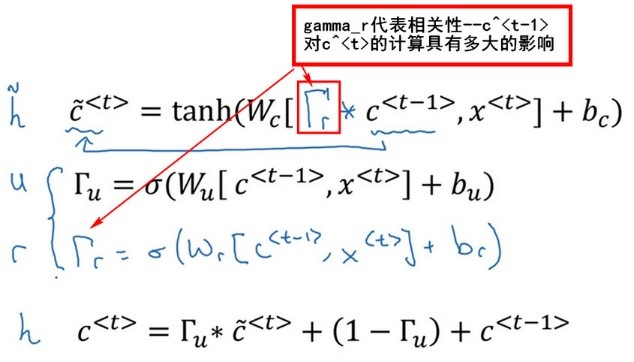

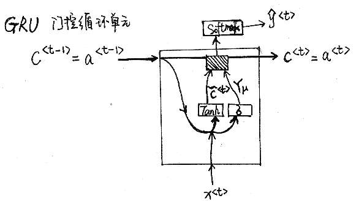

GRU计算过程

GRU单元输入C<t−1>对应于上一个时间步，先假设其正好等于a<t−1>, 然后x<t>也作为输入，然后把这两个用合适的权重结合在一起再用Tanh计算，算出c˘<t>即c<t>的替代值

再用一个不同的参数集，通过σ函数计算出γu,即更新门。

最后所有的值通过另一个运算符结合:

C<t>=γu∗C˘<t>+(1−γu)∗C<t−1>

，其输入一个门值，新的候选值和旧的记忆细胞值，得到记忆细胞的新值c<t>=a<t>,也可以把这个值传入Softmax单元中，并计算出预测序列y^<t> 

## 4 **长短期记忆网络**

**长短期记忆网络(Long short term memory)LSTM**

如果知道了GRU是什么LSTM也很好说了，无非是把其中的一些参数具象化了

对比一下GRU，下面就是LSTM对于参数的改动 

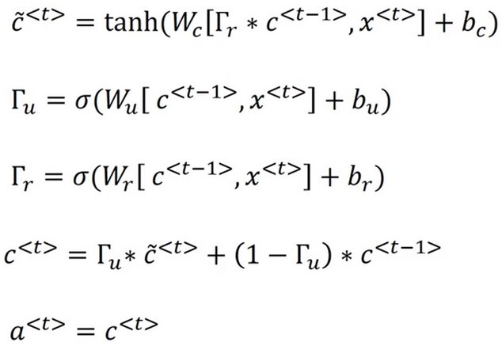

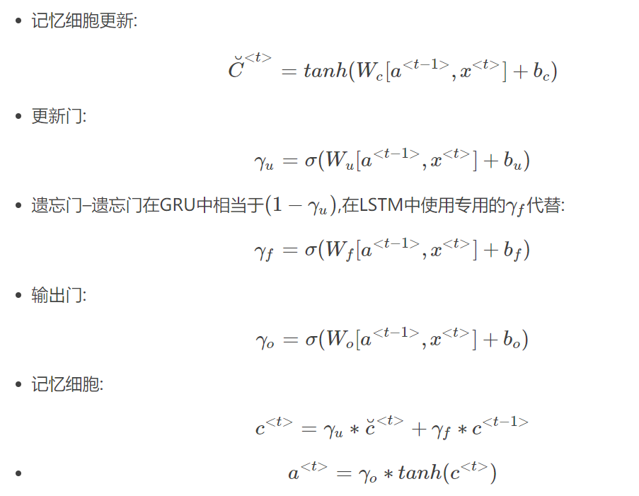

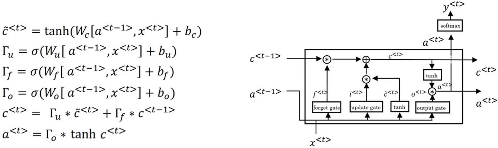

